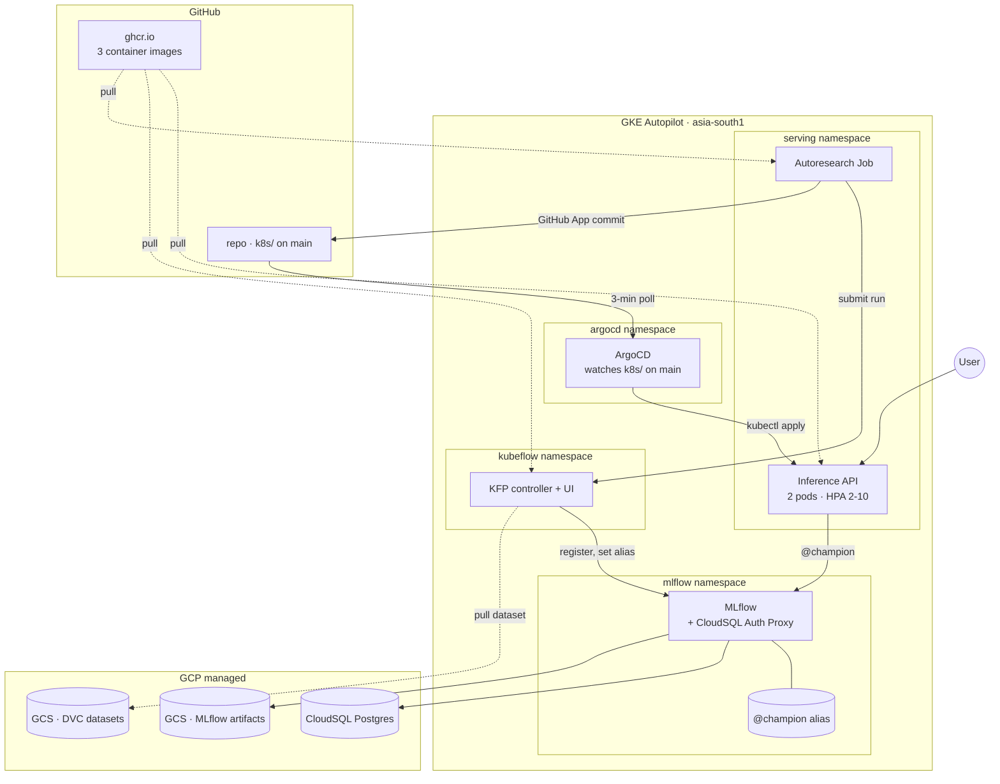
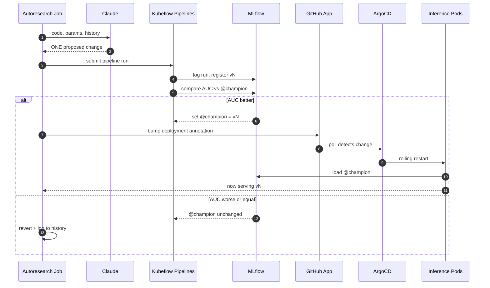

# ML Deployment System for Autoresearch

Drop in a binary-classification CSV, declare its schema, and an LLM iteratively proposes code changes, trains them on Kubernetes, and ships the winners to production via GitOps.

**No human in the loop.**

---

### For non-technical readers

A system that improves an ML model on its own.

- Claude proposes a small change.
- The system trains a new model.
- If it scores better, the new model goes live automatically.
- If it scores worse, the change is discarded and the loop tries something else.

### For technical readers

- A Kubeflow Pipelines run trains and evaluates each candidate on GKE.
- If AUC beats the current `@champion` alias in MLflow by ≥ `min_improvement` (configurable, default 0.001), the autoresearch loop bumps an annotation in `k8s/` and pushes via a GitHub App.
- ArgoCD reconciles, the inference Deployment rolls, new pods re-read `models:/classifier@champion` from MLflow at startup.
- Failed candidates never edit the annotation. The live model can't get worse than the last champion that won.
- Dataset is plug-and-play through `configs/params.yaml`. No code knows the column names.

---

## 🎬 Demo video

*Coming soon!*

---

## 📐 Architecture



### What's deployed

Four artifact stores. All four must be healthy or the loop stalls.

| # | Artifact | Where |
|---|---|---|
| 1 | `@champion` alias on `classifier` | MLflow + CloudSQL |
| 2 | Inference image | `ghcr.io/<user>/inference-api` |
| 3 | KFP base image | `ghcr.io/<user>/pipeline-kfp` |
| 4 | Autoresearch image | `ghcr.io/<user>/autoresearch` |

---

## 🤖 The autoresearch loop

Inspired by [Karpathy's autoresearch](https://github.com/karpathy/autoresearch).



### Why promotion is a chain, not one API call

Setting `@champion` in MLflow alone changes nothing live. Pods loaded their model at startup and hold it in memory.

The annotation bump in `k8s/deployment.yaml` is what triggers the rolling restart. New pods then read `@champion` again at startup. Failed iterations never touch the annotation, so the live model **can't get worse, only different**.

### Who does what

| Actor | Owns | Does NOT |
|---|---|---|
| **Claude** | Propose one change per iter | Touch the cluster |
| **Autoresearch Job** | Apply, submit KFP, commit | Train or evaluate |
| **KFP** | Train + evaluate on GKE | Trigger deploys |
| **MLflow** | Runs, metrics, `@champion` | Restart pods |
| **ArgoCD** | Reconcile cluster to git | Know about models |

```bash
make auto-experiment-dry-run                                  # preview
make autoresearch-run AUTORESEARCH_N=20 AUTORESEARCH_HOURS=2  # real run
```

---

## 🧪 Pipeline stages

Defined in `pipelines/pipeline.py`:

| Stage | Output | Notes |
|---|---|---|
| **preprocess** | `train.csv`, `test.csv` | Reads schema from `params.yaml`, stratified 80/20 split |
| **train** | `classifier.pkl`, `run_id.txt` | sklearn `Pipeline` (Scaler + OHE + estimator), logged to MLflow |
| **evaluate** | `metrics.json` | Sets `@champion` if AUC beats current by ≥ `min_improvement` |

DVC handles data versioning only. Each `data/*.dvc` is a pointer in git, blob in GCS. KFP is the pipeline runner.

### Plug-and-play schema

Swap datasets by replacing this block in `configs/params.yaml`:

```yaml
dataset:
  csv_path: data/ieee_cis.parquet
  target_column: isFraud
  drop_columns: [TransactionID, TransactionDT]
  numeric_features: [TransactionAmt]
  categorical_features: [ProductCD]

train:
  model_type: DecisionTreeClassifier   # deliberately weak starting point
  max_depth: null
  max_features: null
```

The starting point is deliberately weak: vanilla decision tree on a 2-feature subset. A strong baseline would make the loop a no-op — the climb is the point.

---

## 🏁 Spin it up

```bash
make cluster-wake                              # bring up GKE + CloudSQL + KFP + ArgoCD
make reset-for-fresh-run                       # baseline classifier@v1 (vanilla DT)
make autoresearch-run AUTORESEARCH_N=20        # let Claude iterate 20×
make cluster-sleep                             # tear down to ~$0/day idle
```

You'll need a GCP project, an Anthropic API key, and a GitHub App PEM in GCP Secret Manager. Setup commands live in `Makefile` — `make` lists them.

For local dev:

```bash
uv sync                              # install
uv run dvc pull                      # pull dataset from GCS
make test                            # run pytest
make mlflow-kill && make mlflow      # port-forward GKE MLflow
make serve                           # local API → POST /predict
```

---

## 🔁 GitOps: why ArgoCD, why not Helm

Raw YAML manifests + ArgoCD. No Helm, no Kustomize.

ArgoCD reconciles `k8s/` against the live cluster every ~3 minutes. Git is the source of truth for what's deployed.

| Format | Earns its keep when | Used here |
|---|---|---|
| Raw YAML | Small apps, one environment | ✅ 4 files in `k8s/` |
| Helm | Many envs (dev/staging/prod) or 10+ services sharing config | ❌ |
| Kustomize | Environment variants | ❌ |

The one-line `sed` in CI that swaps the image tag does the same thing as `helm upgrade --set image.tag=...`. With one cluster and four manifests, a Chart would be more code to maintain than the manifests it replaces.

---

## ☁️ Infrastructure

| Component | What |
|---|---|
| GKE Autopilot | `mlops-cluster`, `asia-south1` |
| MLflow backend | CloudSQL Postgres 15 |
| MLflow artifacts | GCS bucket |
| DVC remote | GCS bucket |
| Images | `ghcr.io/<user>/{inference-api, pipeline-kfp, autoresearch}` |
| Workload Identity | Pods bind to GCP SAs; no SA keys mounted |
| Secrets | Anthropic key + GitHub App PEM in GCP Secret Manager |

---

## 🛠️ Tools and why

| Tool | Why |
|---|---|
| **MLflow** | Runs, registry, `--serve-artifacts` proxy. `@champion`/`@challenger` aliases give clean promotion semantics. |
| **Kubeflow Pipelines** | K8s-native; each step a container; DAG view built-in. |
| **DVC** | Data versioning. Pointer in git, blob in GCS. *(Not used as a pipeline runner.)* |
| **ArgoCD** | Reconciles cluster to git. Push = deploy. |
| **GitHub Actions** | Lint, test, build images. Path-filtered so docs don't trigger image rebuilds. |
| **GitHub App + GraphQL** | Autoresearch commits are signed and verified. No PAT. |
| **CloudSQL** | Survives pod restarts. SQLite-on-PVC didn't; the registry got wiped twice before I swapped backends. |
| **uv + ruff** | Fast Python tooling. |

---

## 🗺️ Roadmap

- **IEEE-CIS Fraud Detection dataset** (590K × 433). Telco Churn caps near AUC 0.84; IEEE-CIS gives the loop a real climb.
- **20+ iter autoresearch run** on IEEE-CIS, with the AUC-vs-iteration trajectory plot.
- **Cost plot.** Anthropic tokens per iteration are already logged to MLflow. A Make target turns the history into a `$ spent vs. AUC gained` chart.
- **Argo Rollouts canary.** 10% traffic, abort on `/health` regression, auto-rollback.
- **API auth.** Cloudflare Access or a shared API key. Open right now because the demo URL has to work for whoever clicks it.
- **CI MLflow.** CI uses an ephemeral MLflow today; promotions inside CI hit a throwaway DB. A stable CI-accessible endpoint would close that loop.

### Current scope

Personal portfolio project — not a 5-nines production deployment.

- Single zone. A zone outage takes everything down.
- Free-trial GCP credits, so the public IPs are stable per cluster lifetime but not forever.
- No data-drift monitoring, no auto-retraining triggers. **Autoresearch is the retraining mechanism.**
  - The autoresearch loop has currently no ```min_iterations_since_improvement``` stop condition for runs once progress has stagnated
- No model-serving benchmarking (TTFT, P99). Separate project.
