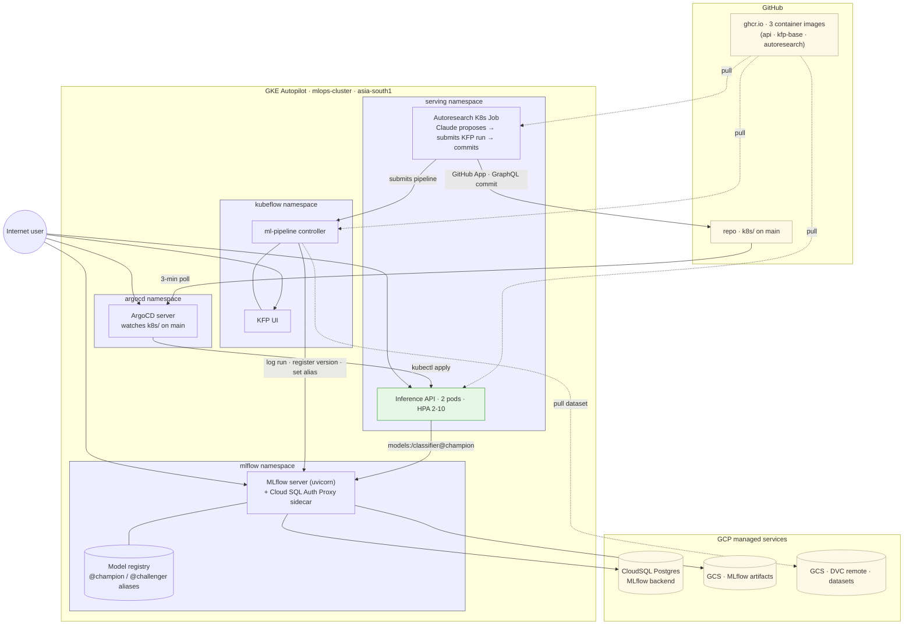
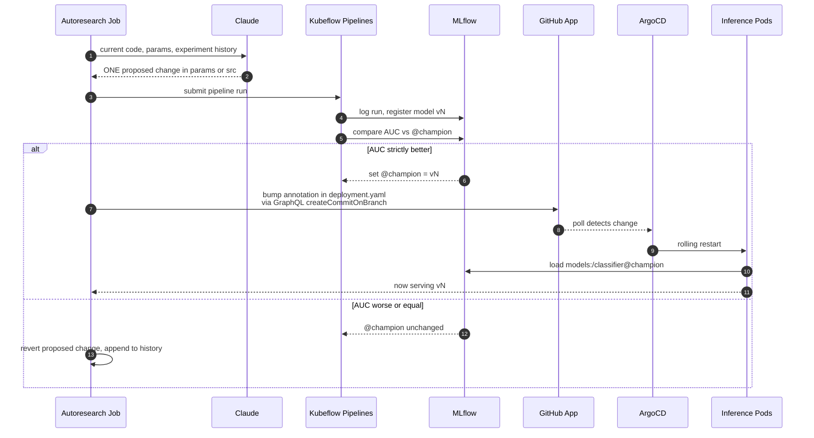

# ML Deployment System for Autoresearch

Drop in a binary-classification CSV, declare its schema, and an LLM iteratively proposes code changes, trains them on Kubernetes, and ships the winners to production via GitOps. Nobody clicks *approve*.

---

### For non-technical readers

This is a system that improves a machine-learning model on its own. An AI (Claude) proposes a small change, the system trains a new model, measures whether it is actually better, and if it is, automatically deploys it to a live API that anyone on the internet can call. If the new model is worse, the system discards the change and tries something else. Nobody needs to click *approve* for any of this.

### For technical readers

A Kubeflow Pipelines run trains and evaluates a candidate model on GKE. If its AUC strictly beats the current `@champion` alias in MLflow, the autoresearch loop bumps a deployment annotation in `k8s/` and pushes a commit via a GitHub App. ArgoCD reconciles the change, the inference Deployment rolls, and the new pods re-read `models:/classifier@champion` from MLflow at startup. Failed candidates never edit the annotation, so the live model never gets worse than the last champion that won. Dataset is plug-and-play through `configs/params.yaml`; no code knows the column names.

---

## 🚀 Live demo

| Surface | URL | What you see |
|---|---|---|
| Prediction API | <http://34.180.37.1/predict> | POST a row, get a probability |
| Health | <http://34.180.37.1/health> | `model_version` of the currently-served champion |
| MLflow | <http://34.180.20.197:5000> | All runs, all model versions, the `@champion` alias |
| KFP | <http://34.93.2.209> | Pipeline DAGs in real time |
| ArgoCD | <http://34.100.246.237> | Sync status, rollout history (login shown in the demo video) |

```bash
curl -X POST http://34.180.37.1/predict \
  -H "Content-Type: application/json" \
  -d '{"data":{"gender":"Female","SeniorCitizen":0,"Partner":"Yes","Dependents":"No",
       "tenure":12,"PhoneService":"Yes","MultipleLines":"No",
       "InternetService":"Fiber optic","OnlineSecurity":"No","OnlineBackup":"No",
       "DeviceProtection":"No","TechSupport":"No","StreamingTV":"No",
       "StreamingMovies":"No","Contract":"Month-to-month","PaperlessBilling":"Yes",
       "PaymentMethod":"Electronic check","MonthlyCharges":70.35,"TotalCharges":846.0}}'
# → {"prediction":0,"probability":0.26,"model_version":"5"}
```

## 🎬 Demo video

*Loom walkthrough — link goes here.*

---

## 📐 Architecture

Everything inside the GKE cluster, plus the GCP and GitHub services it depends on:



### What's actually deployed

Four artifact stores. All four have to be healthy for the loop to run end-to-end; any one of them broken stalls everything.

| # | Artifact | Where | Purpose |
|---|---|---|---|
| 1 | `@champion` alias on the `classifier` registered model | GKE MLflow + CloudSQL | The single declared production model. Pods re-read this on every restart. |
| 2 | Inference container image | `ghcr.io/<user>/churn-api` | What every Pod in the inference Deployment runs |
| 3 | KFP base image | `ghcr.io/<user>/churn-kfp` | Used by every preprocess / train / evaluate step inside KFP |
| 4 | Autoresearch container image | `ghcr.io/<user>/autoresearch` | Runs the Claude → KFP → MLflow → GitHub loop as a K8s Job |

---

## 🤖 The autoresearch loop

Inspired by [Karpathy's autoresearch](https://github.com/karpathy/autoresearch). One iteration end-to-end:



**Promotion is a chain, not one API call.** Setting `@champion` in MLflow on its own changes nothing live; the running pods loaded their model at startup and hold it in memory. The annotation bump in `k8s/deployment.yaml` is what triggers the rolling restart, and the new pods read `@champion` again from MLflow on startup. Failed iterations never touch the annotation, so the live model can't get worse — only different.

### Who does what

| Actor | Role | Does NOT do |
|---|---|---|
| **Claude** (LLM) | Proposes one code/config change per iteration | Touch the cluster, MLflow, or git directly |
| **Autoresearch Job** | Applies proposals, submits KFP runs, commits via GitHub App | Train models or evaluate them |
| **KFP** | Runs preprocess → train → evaluate on GKE | Trigger deployments or commit to git |
| **MLflow** | Stores runs, metrics, registers versions, owns `@champion` | Send notifications or restart pods |
| **ArgoCD** | Reconciles cluster state to git | Know about models, experiments, or MLflow |

```bash
# Preview what Claude would propose (no pipeline run)
make auto-experiment-dry-run

# Submit a real iteration loop (requires ANTHROPIC_API_KEY)
make autoresearch-run AUTORESEARCH_N=20 AUTORESEARCH_HOURS=2
```

---

## 🧪 Pipeline stages

A Kubeflow pipeline run, defined in `pipelines/pipeline.py`:

| Stage | Input | Output | What it does |
|---|---|---|---|
| **preprocess** | dataset CSV (DVC-fetched from GCS) | `train.csv`, `test.csv`, `stats.json` | Read schema from `params.yaml`, encode target, stratified 80/20 split |
| **train** | `train.csv` | `classifier.pkl`, `run_id.txt` | Fit sklearn `Pipeline` (StandardScaler + OneHotEncoder + chosen estimator), log to MLflow, register model |
| **evaluate** | `test.csv`, `classifier.pkl` | `metrics.json` | Score model, log metrics, set `@champion` alias if AUC strictly improves |

DVC here is for data versioning only. Each `data/*.dvc` is a pointer file in git with the blob in GCS, so any commit maps to one dataset hash. KFP is the pipeline runner.

### Plug-and-play schema

The whole stack reads the dataset shape from one block. To swap datasets, replace this:

```yaml
# configs/params.yaml
dataset:
  csv_path: data/churn_data.csv
  target_column: Churn
  target_mapping: {"Yes": 1, "No": 0}    # omit if already 0/1
  drop_columns: [customerID]
  numeric_features: [tenure]              # deliberately weak baseline
  categorical_features: []

train:
  model_type: DecisionTreeClassifier      # the bad starting point
  max_depth: 1
  max_features: 1
```

The starting point is deliberately weak: depth-1 decision tree on one numeric feature, AUC around 0.55. A strong baseline would make the autoresearch loop a no-op, so I needed a baseline with somewhere to go.

---

## ⚡ Quick start

```bash
# Install deps
uv sync

# Pull the dataset from GCS (DVC = data versioning only)
uv run dvc pull

# Run pytest
make test

# Run the inference API locally against the GKE MLflow
make mlflow-kill && make mlflow      # port-forward GKE MLflow → localhost:5000
make serve                            # POST localhost:8000/predict
```

---

## 🔁 GitOps: why ArgoCD (and why not Helm)

This project uses raw YAML manifests with ArgoCD. No Helm, no Kustomize.

ArgoCD's only job is to make the cluster match what's in git. Every ~3 minutes it compares `k8s/` against the live cluster state, and if they differ, it applies the git version. Git is the source of truth for what's deployed.

```
Without ArgoCD:                              With ArgoCD:
CI updates k8s/deployment.yaml               CI updates k8s/deployment.yaml
↓                                            ↓
git push                                     git push
↓                                            ↓
NOTHING HAPPENS                              ArgoCD detects within 3 min
↓                                            ↓
Someone runs kubectl apply                   Rolling update, automatic
(who? when? did they forget?)                Auditable via git log
```

| Source format | When to use it | Used here? |
|---|---|---|
| Raw YAML | Small apps, < 10 manifests, one environment | **Yes** — 4 files in `k8s/` |
| Helm | Many environments (dev/staging/prod), templating | No — one cluster, one env |
| Kustomize | Environment variants without Go templates | No — same reason |

The one-line `sed` in CI that swaps the image tag does the same thing `helm upgrade --set image.tag=...` would. Helm earns its keep once you have multiple environments or many services sharing config. I have one cluster and four manifests; a Chart would be more code to maintain than the manifests it replaces.

---

## ☁️ Infrastructure

| Component | Details |
|---|---|
| GKE Autopilot | `mlops-cluster`, `asia-south1`, autoscales |
| MLflow backend | CloudSQL PostgreSQL 15 (db-f1-micro) |
| MLflow artifacts | GCS bucket (`*-mlflow-artifacts-*`) |
| DVC remote | GCS bucket (`customer-churn-dvc-remote`) |
| Container registry | `ghcr.io/<user>/{churn-api,churn-kfp,autoresearch}` (multi-arch on amd64) |
| Workload Identity | Pods bind to GCP SAs. No service-account keys mounted in containers. |
| Secrets | `ANTHROPIC_API_KEY`, GitHub App PEM in GCP Secret Manager |

### Cluster setup

```bash
# Connect kubectl to the cluster
gcloud container clusters get-credentials mlops-cluster \
  --region=asia-south1 --project=<project-id>

# Bootstrap the registry: train one baseline model and set @champion
make mlflow-kill && make mlflow
make bootstrap

# Verify
curl http://34.180.37.1/health   # → {"model_loaded": true, "model_version": "..."}
```

---

## 🛠️ Tools and why

| Tool | Role | Why |
|---|---|---|
| **MLflow** | Experiment tracking + model registry + artifact proxy | Industry standard. `@champion`/`@challenger` aliases give clean promotion semantics. CloudSQL backend + GCS artifacts via `--serve-artifacts` means clients never need direct bucket access. |
| **Kubeflow Pipelines** | K8s-native training orchestration | Each step is a container, scales independently, DAG visualisation built-in. The same image powers preprocess / train / evaluate. |
| **DVC** | Data versioning | One pointer file per dataset in git, blob in GCS. Any git commit deterministically maps to one dataset hash. (Not used as a pipeline runner — KFP is.) |
| **ArgoCD** | GitOps deployment | Continuously reconciles cluster state to git. Push = deploy. Auditable via git log. |
| **GitHub Actions** | CI/CD | Lint, test, build images, push to ghcr.io. Path-filtered so docs-only changes don't trigger image rebuilds. |
| **GitHub App + GraphQL** | Autoresearch's commit identity | The autoresearch Job authenticates as `ML-deployment-for-autoresearch`, signs commits via `createCommitOnBranch` so pushes carry verified-author signatures (no PAT, no service-account leakage). |
| **GKE Autopilot** | Managed Kubernetes | No node management. Pay-per-pod. Stable LoadBalancer IPs. |
| **CloudSQL** | Postgres for MLflow | Survives pod restarts. SQLite-on-PVC didn't; the registry got wiped twice before I swapped backends. |
| **uv + ruff** | Python tooling | Fast, replace pip/poetry/pyenv and flake8/black/isort. |

---

## 🗺️ Roadmap

What's built next, roughly in order:

- **IEEE-CIS Fraud Detection dataset** (590K rows, 433 features). Telco Churn caps near AUC 0.84, which doesn't leave the loop much room to climb. IEEE-CIS gives the loop a real trajectory to traverse.
- **20+ iteration autoresearch run** on IEEE-CIS, with the AUC-vs-iteration trajectory plot in this README.
- **Cost trajectory plot.** Anthropic input/output tokens per iteration are already logged to MLflow. A Make target turns the history into a `$ spent vs. AUC gained` chart.
- **Argo Rollouts canary.** Replace the rolling Deployment with a canary that holds 10% traffic for N seconds and aborts on a `/health` regression. Auto-rollback on bad champion.
- **API auth.** Cloudflare Access or a single shared API key in front of `/predict`. Open to the public internet right now because the demo URL has to work for whoever clicks it; not worth gating until that stops mattering.
- **CI MLflow.** CI today spins up an ephemeral MLflow for `dvc repro`, so promotions inside CI hit a throwaway DB. A stable CI-accessible MLflow endpoint would close that loop.

### Current scope

A pet project I built to learn MLOps end-to-end, not a 5-nines production deployment. Choices that follow from that:

- Single zone (`asia-south1-c`). A zone outage takes everything down.
- Free-trial GCP credits, so the public IPs are stable per cluster lifetime but not forever.
- No data-drift monitoring, no auto-retraining triggers. Autoresearch *is* the retraining mechanism here.
- No model-serving benchmarking (TTFT, P99 latency). That work lives in a separate project.
